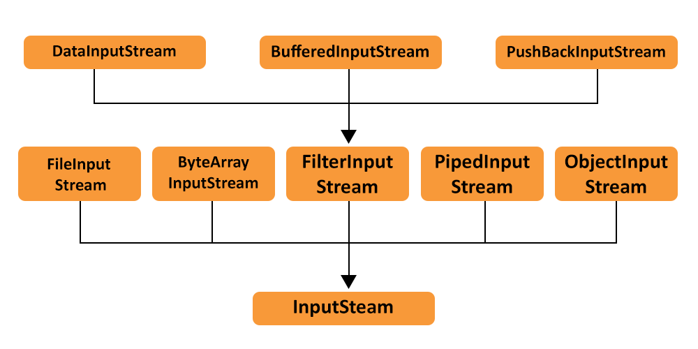

# Day 12:-27 June 2024

## File I/O in Java
The java.io.File class is a representation of file and directory pathnames in Java. It provides various methods to manipulate these pathnames and the files they represent. This class is part of the Java Core Libraries and is crucial for file operations such as creating, deleting, and checking file properties.
```java
import java.io.File;
import java.io.IOException;

public class FileExample {
public static void main(String[] args) {
try {
File myFile = new File("filename.txt");
if (myFile.createNewFile()) {
System.out.println("File created: " + myFile.getName());
} else {
System.out.println("File already exists.");
}
} catch (IOException e) {
System.out.println("An error occurred.");
e.printStackTrace();
}
}
}
```

### Java Stream
<ol>
 <li>InputStream</li>
 <li>OutputStream</li>
</ol>

#### InputStream


#### OutputStream
