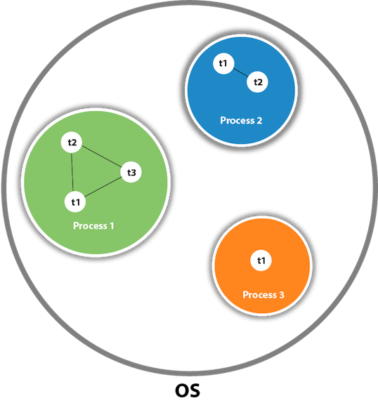

# Day 13:-28 June 2024

## Multithreading
Multithreading in Java is a process of executing multiple threads simultaneously.
A thread is a lightweight sub-process, the smallest unit of processing. Multiprocessing and multithreading, both are used to achieve multitasking.


### Life cycle of thread
<ul>
  <li>New<li>
  <li>Active</li>
  <li>Blocked/Waiting</li>
  <li>Timed Waiting<li>
  <li>Terminated</li>
</ul>

### Example
```java
class Multi extends Thread{  
public void run(){  
System.out.println("thread is running...");  
}  
public static void main(String args[]){  
Multi t1=new Multi();  
t1.start();  
 }  
}  
```