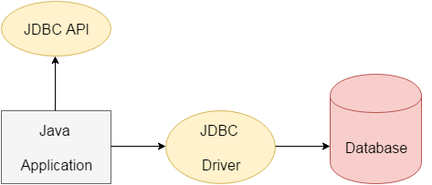

# Day 17:-4 July 2024

## JDBC (Java Database Connectivity)
JDBC stands for Java Database Connectivity. JDBC is a Java API to connect and execute the query with the database. It is a part of JavaSE (Java Standard Edition). JDBC API uses JDBC drivers to connect with the database.

## Steps to Java Database Connectivity
There are 5 steps to connect any java application with the database using JDBC. These steps are as follows:
<ul>
  <li>Register the Driver class</li>
  <li>Create connection</li>
  <li>Create statement</li>
  <li>Execute queries</li>
  <li>Close connection</li>
</ul>


## Example
```java
import java.sql.*;  
class OracleCon{  
public static void main(String args[]){  
try{  
//step1 load the driver class  
Class.forName("oracle.jdbc.driver.OracleDriver");  
  
//step2 create  the connection object  
Connection con=DriverManager.getConnection(  
"jdbc:oracle:thin:@localhost:1521:xe","system","oracle");  
  
//step3 create the statement object  
Statement stmt=con.createStatement();  
  
//step4 execute query  
ResultSet rs=stmt.executeQuery("select * from emp");  
while(rs.next())  
System.out.println(rs.getInt(1)+"  "+rs.getString(2)+"  "+rs.getString(3));  
  
//step5 close the connection object  
con.close();  
  
}catch(Exception e){ System.out.println(e);}  
  
}  
}  
```