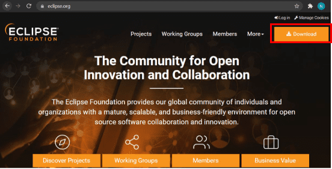
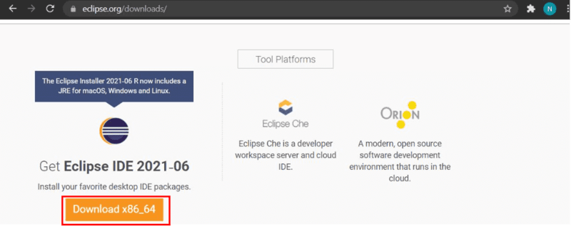
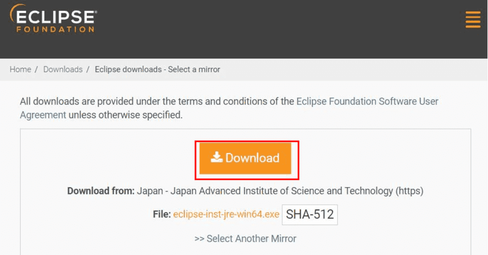
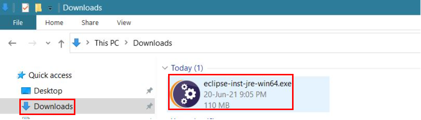
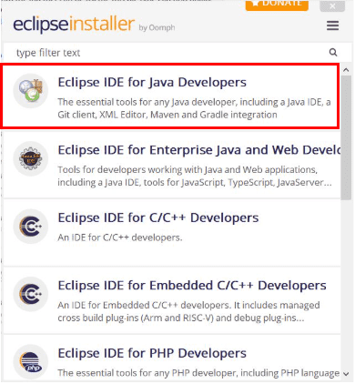
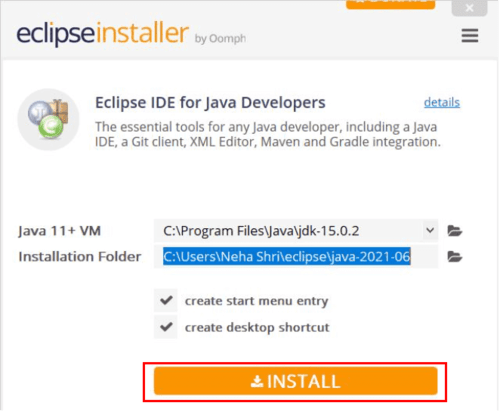
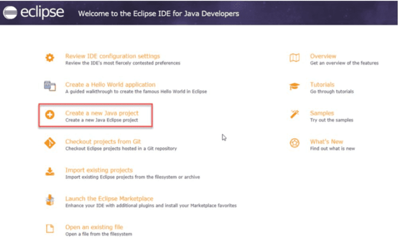

# Day 2:-12 June 2024
## Installation of java Runetime Environment (Eclipse)

### Steps 1:-
In the first step, Open your browser and navigate to https://www.eclipse.org/

### Step 2:-
Then, click on the “Download” button to download Eclipse IDE.

### Step 3:-
Now, click on the “Download x86_64” button. 

### Step 4:-
Then click on the “Download” button. After clicking on the download button the .exe file for the eclipse will be downloaded.

### Step 5:-
Now go to File Explorer and click on “Downloads” after that click on the “eclipse-inst-jre-win64.exe” file for installing Eclipse IDE.

### Step 6:-
Then, click on “Eclipse IDE for Java Developers”.

### Step 7:-
Then, click on the “Install” button.

### Step 8:-
Now click on “Create a new Java project”. 

### Now, you’re prepared to make new Java initiatives the usage of eclipse IDE