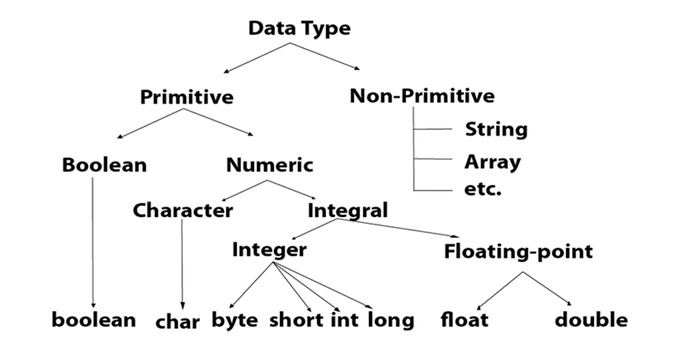

# Day 2:-13 June 2024
## Data Types,Operators,Control Statements
### Activity:-
Practiced basic syntax and simple programs & Wrote programs using if-else, switch-case, and different loops.
###  Data Types

Data types specify the different sizes and values that can be stored in the variable. There are two types of data types in Java: 
<ul>
    <li><b>Primitive data types:-</b> The primitive data types include boolean, char, byte, short, int, long, float and double. </li>
    <li><b>Non-primitive data types:-</b> The non-primitive data types include Classes, Interfaces, and Arrays.</li>
</ul>



### Operators 
Operator in Java is a symbol that is used to perform operations. For example: +, -, *, / etc. There are many types of operators in Java which are given below:
<ul>
    <li>Uniary Operator</li>
    <li>Arithmetic Operator</li>
    <li>Shift Operator</li>
    <li>Relational Operator</li>
    <li>Bitwise Operator</li>
    <li>Relational OPerator</li>
    <li>Logical Operator</li>
    <li>Ternary Operator</li>
    <li>Assignment Operator</li>
</ul>

### Control Statement

Java compiler executes the code from top to bottom. The statements in the code are executed according to the order in which they appear. However, Java provides statements that can be used to control the flow of Java code. Such statements are called control flow statements.
#### Java provides three types of control flow statements.
<ul>
    <li>Decision Making statement</li>
    <li>Loop Statement</li>
    <li>Jump Statement</li>
</ul>

#### Example
```java
if (num > 0) { 
    System.out.println("Positive"); 
} else { 
    System.out.println("Negative"); 
}
```
